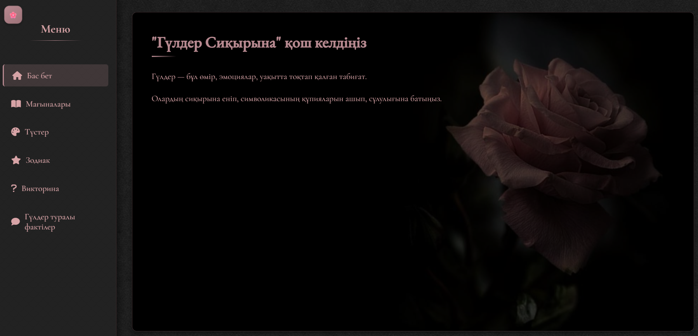
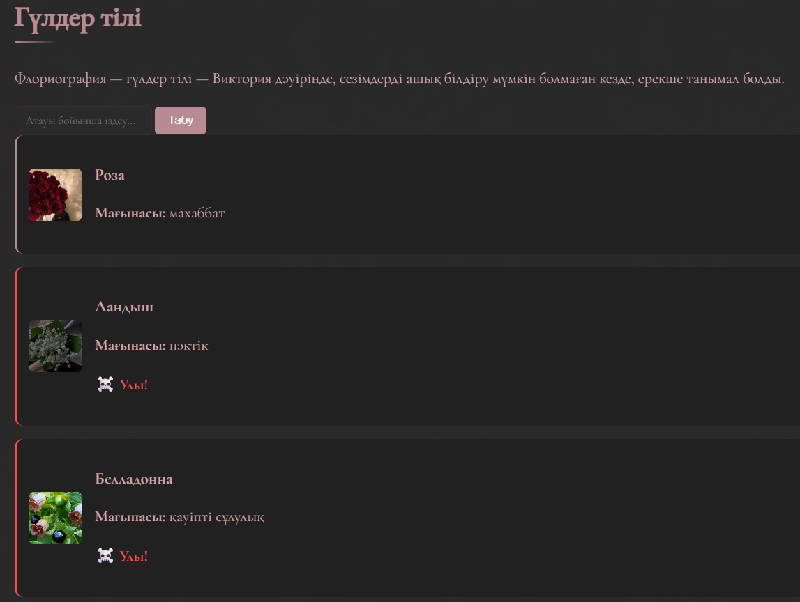
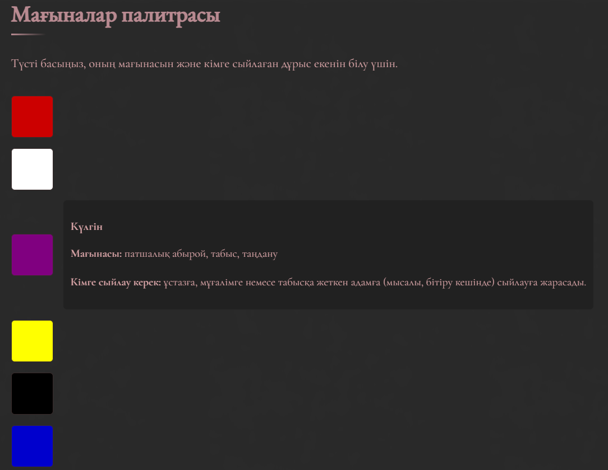
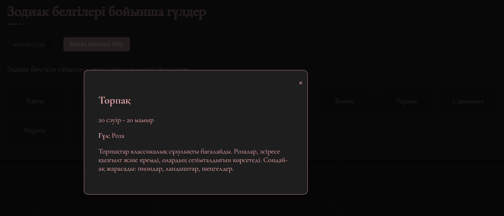

# 🌸 Magic Flowers

> *"Flowers are life, emotions, nature frozen in time."*

A beautifully designed interactive web app about the secret language of flowers — built entirely in Kazakh. Explore flower meanings, color symbolism, zodiac flower pairings, fun quizzes, and fascinating flower facts.

---

## ✨ Features

- **🌹 Language of Flowers (Гүлдер тілі)** — search flowers by name and discover their symbolic meaning; toxic flowers are flagged with a ☠️ warning
- **🎨 Color Palette (Мағыналар палитрасы)** — click any color to learn its meaning and who it's best gifted to
- **⭐ Zodiac Flowers (Зодиак белгілері)** — enter your birthdate to find the flowers that match your zodiac sign
- **❓ Quiz (Викторина)** — test your knowledge of flower symbolism
- **📖 Flower Facts (Гүлдер туралы фактілер)** — interesting facts about flowers
- Elegant dark aesthetic with a rose-themed UI

---

## 📸 Screenshots

| Home | Language of Flowers |
|---|---|
|  |  |

| Color Palette | Zodiac Flowers |
|---|---|
|  |  |

---

## 🛠 Tech Stack

| Layer | Technology |
|---|---|
| Markup | HTML5 |
| Styling | CSS3 |
| Logic | Vanilla JavaScript |
| Architecture | Single-file SPA (`MAGIC_FLOWERS.html`) |

No frameworks, no dependencies, no build step — just one HTML file.

---

## 🚀 Getting Started

```bash
git clone https://github.com/albina0dali/Magic-Flowers.git
cd Magic-Flowers
```

Then simply open `MAGIC_FLOWERS.html` in your browser. Done.

---

## 👩‍💻 Author

**Albina Gibadullina** — Dept. of Artificial Intelligence Technologies, L.N. Gumilyov Eurasian National University, Astana, Kazakhstan
